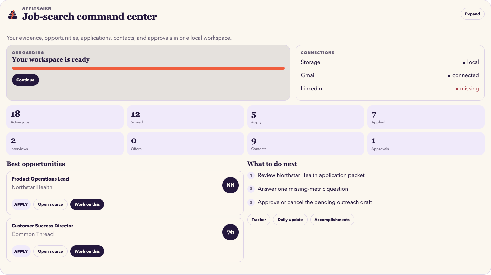

<p align="center"></p>

# ApplyCairn

ApplyCairn is a free-to-use, proprietary job-search ecosystem for Codex and Claude Desktop. It was created and published by **ApplyCairn**. The development source is private; this repository contains only the installable runtime and required plugin files.



See the complete privacy-safe product tour at [scumunna.github.io/applycairn](https://scumunna.github.io/applycairn/).

## Install in Codex desktop

1. Add this GitHub repository as a plugin marketplace: `scumunna/applycairn-releases`.
2. Open Plugins, find **ApplyCairn**, and choose Install.
3. Start a new task and type `start`.

Command-line equivalent:

```sh
codex plugin marketplace add scumunna/applycairn-releases
```

Then install ApplyCairn from the Codex Plugins screen.

## Install in Claude Desktop

Download `ApplyCairn-0.2.1.mcpb` from the [v0.2.1 release](https://github.com/scumunna/applycairn-releases/releases/tag/v0.2.1), open it with Claude Desktop, choose a local data folder, and type `start` in a new conversation.

## What stays local

Resumes, accomplishments, profiles, jobs, contacts, application trackers, approvals, and exports stay in a folder the user controls. ApplyCairn does not require a separate model API key. The user's eligible Codex or Claude account supplies the model.

## License and authenticity

Copyright 2026 ApplyCairn. All rights reserved. Free use does not grant permission to copy, modify, redistribute, rebrand, sublicense, or sell ApplyCairn. Runtime files installed on a computer can be inspected; they are not open source. Verify release checksums against `release-assets/SHA256SUMS.txt`.
